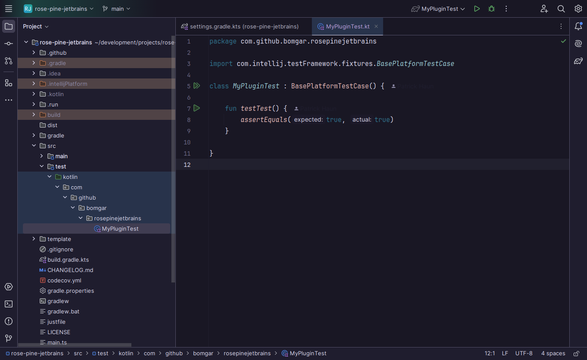
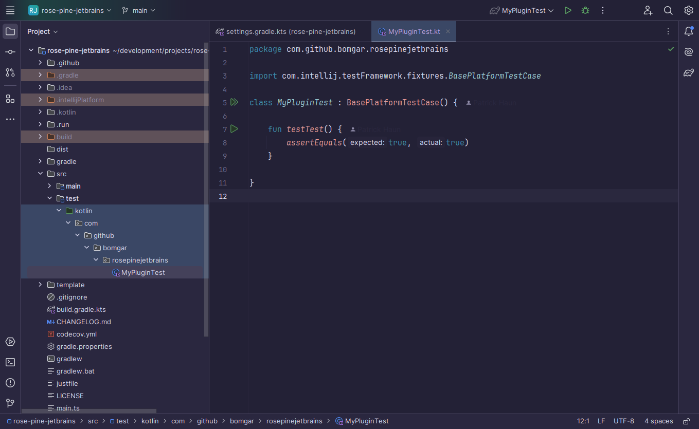
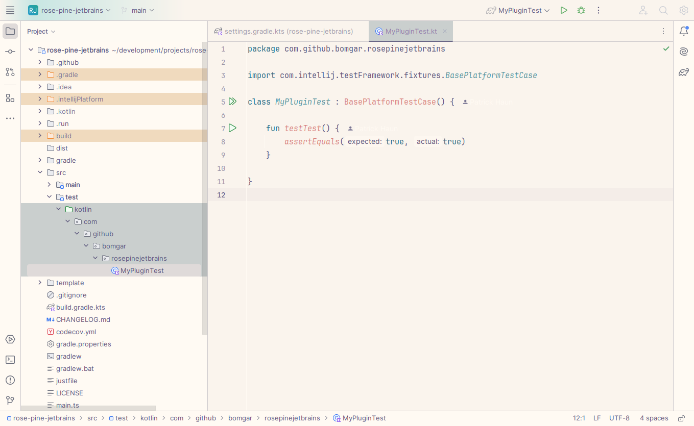

    
    <h2 align="center">Rosé Pine for JetBrains IDEs</h2>

All natural pine, faux fur and a bit of soho vibes for the classy minimalist

    

## Usage

- Using the IDE built-in plugin system:
  
  <kbd>Settings/Preferences</kbd> > <kbd>Plugins</kbd> > <kbd>Marketplace</kbd> > <kbd>Search for "rose pine"</kbd> >
  <kbd>Install</kbd>
  
- Using JetBrains Marketplace:

  Go to [JetBrains Marketplace](https://plugins.jetbrains.com/plugin/28154-rose-pine-theme) and install it by clicking the <kbd>Install to ...</kbd> button in case your IDE is running.

  You can also download the [latest release](https://plugins.jetbrains.com/plugin/28154-rose-pine-theme/versions) from JetBrains Marketplace and install it manually using
  <kbd>Settings/Preferences</kbd> > <kbd>Plugins</kbd> > <kbd>⚙️</kbd> > <kbd>Install plugin from disk...</kbd>

- Manually:

  Download the [latest release](https://github.com/bomgar/rose-pine-jetbrains/releases/latest) and install it manually using
  <kbd>Settings/Preferences</kbd> > <kbd>Plugins</kbd> > <kbd>⚙️</kbd> > <kbd>Install plugin from disk...</kbd>

## Gallery

## Thanks to

- [Bomgar](https://github.com/bomgar)

## Contributing

Modify the templates using Rosé Pine variables, then build variants. See [justfile](./justfile).
 
